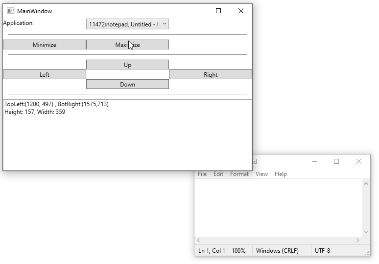

# C# window manipulation app

This app exists as a process of checking some ideas 
for doing tiling window manager under W10. 

Current approach is just to get Window handle and 
manipulate it via WinAPI (user32.dll) bindings. 

Hopefully tile arrangement of window will also work.
But this is for the future to show

# Moving windows

As per 4f5c30b3 I am able to reliable move window using 
combination of user32.dll calls `GetClientRect`, `GetWindowRect` and `MoveWindow`. 

# Build

TODO: this doesn't have any build currently it build by 
Rider and I am fine with it.

# License

Licensed under MIT License as this is 